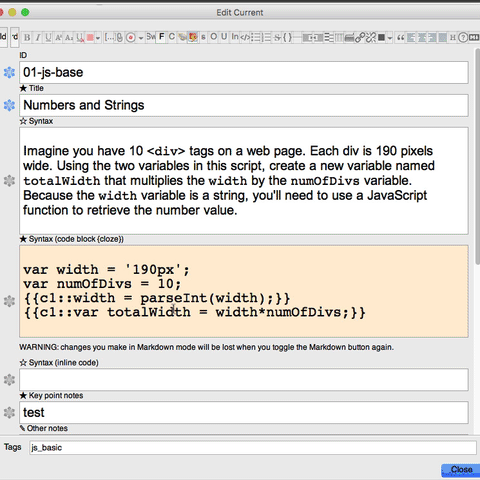

# Anki Cloze Theme: How to add content to cards

- [Home](../../README.md)
  - **THEME**
    - [Simple Anki theme](../simple/README.md)
    - [Puzzle Anki theme](../puzzle/README.md)
    - **Cloze Anki theme**
      - [Deck example](../../deck/README.md)
      - [Notes](#notes)
    - [Selectable](../selectable/README.md)
  - **THEME COLOURS**
    - [Basic highlighting](../assets/css/README.md)
    - [Automatic highlighting](../assets/css/README.md#automatic-syntax-highlighting-with-pygments)

> I've been experimenting and using this theme A LOT. It's very quick to generate lots of cards, but takes a little care and consideration to get right.

## Card #01
> **Key:** ★ Required / ☆ Optional (recommended)

### Open-form question/answers

The Cloze theme is very flexible. You can do pretty much anything you like with it, and generate as many cards as you like (though I advise _no more than **5** per note_, or things can become unwieldy).

You'll recognise some of these fields from the [Puzzle](../simple/README.md) and [Simple](../simple/README.md) themes.

#### ★ Title

- The main question, statement or fact.

#### ☆ Syntax

- The type of `Syntax` we're learning.

#### ★ Syntax (code block {cloze})

- The actual function or symbol, i.e. `len()`.
- This will be wrapped in `<code>`.

#### ☆ Sample (code block or image)

- Here we create our cloze deletions, allowing us to hide/show code easily — You can [learn more about clozes in the Anki documentation](http://ankisrs.net/docs/manual.html#cloze-deletion). _See [notes about known bug](#notes) in Anki Power Format Pack plugin._
  - Enter a `<pre>` block with a cloze tag:
    - `x.{{c1::is_integer()::x is a float, check if int}}`
  - You can use multiple cloze tags on the same card:
    - `{{c1::int(x)::x is a string, convert to int}}`
  - Or, create separate cards within the same code block:
    - `print('True if x.{{c1::is_integer()}} else {{c2::'False'}})`
  - Syntax highlighting [using the included themes](../assets/css/README.md).

#### ★ Key point notes

- A short explanation of what we're trying to learn.
- For any key functions or symbols, wrap in `<code>`.

-----

## Extra fields
> **Key:** ✎ Optional

#### ✎ Other notes

Use sparingly, as it's always best to be succinct with Anki. Think of this as a 'reference' for future use:

- Links to documentation
- Supplementary notes
- Anything that is universal between cards

#### ✎ Markdown

- Store raw `.md` for future editing, if necessary

-----

## Notes

1. Power Format Pack [renders the cloze fields as `pre` code](https://github.com/Neftas/supplementary-buttons-anki/issues/74), not cloze tags. This can be easily rectified by writing your code, converting to Markdown, _then_ adding the cloze tags (perhaps keeping the `{{c1:cloze tags}}` in the extra [Markdown](#-markdown) field as a backup.)
2. Fields marked **Optional** fields (☆ ✄ ♻ ✎) can be left blank and the template will ignore them. **Required** fields (✔ and ♞) are required in order for a card to be generated.
3. You can reference fields within fields. For instance:
  - `{{☆ Syntax (inline code)}}` or `{{★ Key point (code block or image)}}`. This will pick up all the HTML from those fields.
  - Keep in mind any referenced fields will have to be manually edited if the field name is ever changed, which can be a huge pita.
