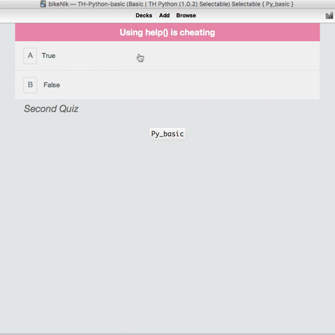

# Anki Simple Theme: How to add content to cards

- [Home](../../README.md)
  - **THEME**
    - [Simple Anki theme](../simple/README.md)
    - [Puzzle Anki theme](../puzzle/README.md)
    - [Cloze Anki theme](../cloze/README.md)
      - [Deck example](../../deck/README.md)
      - [Notes](#notes)
    - **Selectable**
  - **THEME COLOURS**
    - [Basic highlighting](../assets/css/README.md)
    - [Automatic highlighting](../assets/css/README.md#automatic-syntax-highlighting-with-pygments)

    ## Card #01
> **Key:** ★ Required / ☆ Optional (recommended)

### What's the answer?

The fields of the choice are showing in a random order.   

#### ★ Title

- The main question, statement or fact.

#### ☆ Syntax

- The type of `Syntax` we're learning.

#### ★ Selectable choices

- Choose from the offered answers.
- The correct answers there can be one, two or all.
- if the quantity of the selected fields are more or less than correct - any isn't correct.
- filling this field has to correspond to `variant-1 | variant-2 | variant-3` e.t.c
- the correct answer must be noted by italics `variant-1 | <i>variant-2</i> | variant-3`

#### ☆ Sample (code block or image)

- A sample of the code we're learning:
  - Enter a `<pre>` block
    - or if you're feeling lazy, upload a snapshot
  - Syntax highlighting [using the included themes](../assets/css/README.md).

#### ★ Key point (code block or image)**

- What's the main takeaway from this flashcard?
  - Snippet of code, or output.
  - Enter a `<pre>` block
    - or if you're feeling lazy, upload a snapshot
  - Syntax highlighting [using the included themes](../assets/css/README.md).

#### ☆ Key point notes

- A short explanation of what we're trying to learn.
- For any key functions or symbols, wrap in `<code>`.

-----

## Extra fields
> **Key:** ✎ Optional

#### ✎ Other notes

Use sparingly, as it's always best to be succinct with Anki. Think of this as a 'reference' for future use:

- Links to documentation
- Supplementary notes
- Anything that is universal between cards

#### ✎ Markdown

- Store raw `.md` for future editing, if necessary

-----

## Notes

1. Fields marked **Optional** fields (☆ ✄ ♻ ✎) can be left blank and the template will ignore them. **Required** fields (✔ and ♞) are required in order for a card to be generated.
2. You can reference fields within fields. For instance:
  - `{{☆ Syntax (inline code)}}` or `{{★ Key point (code block or image)}}`. This will pick up all the HTML from those fields.
  - Keep in mind any referenced fields will have to be manually edited if the field name is ever changed, which can be a huge pita.